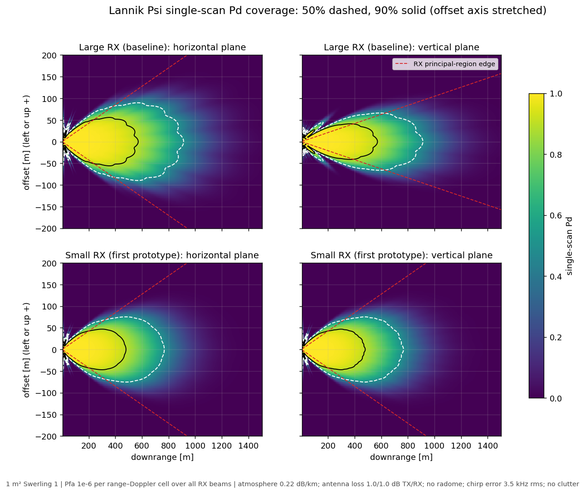

# Lannik Psi antenna-concept study

2026-09-02 to 2026-10-01 · concluded

Lannik Psi is a 76–77 GHz FMCW radar for drone interceptors, built on the
Infineon CTRX8188F MMIC with eight transmit (TX) and eight receive (RX)
channels. This study took it from a generic range estimate to an antenna
concept that could go out for quotation. The study ended when the antenna RFQ
was issued and the first prototype ordered. This page summarises the outcome.
The linked notes hold the reasoning and the dated history.

## Summary

### Antenna concept

- **TX:** one aperture of about 37.6 × 37.6 mm, 16 × 16 radiators in the
  reference design. Its amplitude is tapered and its phase is a smooth
  quadratic ("defocus") that widens the coherent beam to about 12.6° at the
  3 dB points, with 23.4 dBi directivity. The aperture is split into four
  quadrants. Two MMIC ports feed each quadrant, all eight at equal full power,
  with no intentional attenuation.
- **RX:** each channel has its own subarray. Large subarrays give gain, but
  they put the channel phase centres several wavelengths apart. The channel
  array then cannot distinguish directions whose direction cosines differ by a
  whole array period, a grating-lobe ambiguity. One RX measurement is
  unambiguous only inside the *principal region* around boresight.
- **Two RX prototypes:**
  - *Small variant, ordered first:* 2 × 4 channels of 9.4 × 9.4 mm square
    subarrays. Principal region ±12.0° in both planes; 27.5 dBi effective RX
    gain after combining the eight channels.
  - *Large variant, second prototype:* 4 × 2 channels of 9.4 × 18.8 mm
    subarrays. Alternate columns are offset vertically by a quarter of the
    subarray height. Principal region ±12.0° horizontally and ±6.0°
    vertically; 3 dB more RX gain.
- **Ambiguity resolution:** the radar periodically interlaces two MIMO modes,
  in which the left and right TX halves, or the upper and lower halves,
  transmit separable waveforms. The defocus phase makes the two halves'
  responses differ with direction. That distinguishes directions the RX
  array alone cannot. In an ideal four-quadrant MIMO model, with the target
  fluctuating independently between updates, a 1 m² target at the small
  variant's ±12° principal edges is resolved with 99% probability after one,
  two or four MIMO updates out to 226, 363 and 481 m. For the large variant,
  the column offset also let ordinary coherent frames resolve the vertical
  ambiguity in the cases tested.

The antenna RFQ (technical description dated 2026-09-17) is archived as
issued in [deliverables/2026-09-17_rfq/](deliverables/2026-09-17_rfq/README.md).
Supplier design feedback is expected one to two weeks after 2026-10-01, and
the first prototype about six weeks after that.

### Range performance

The computational baseline for range performance is the large variant,
modelled without its column stagger. Ordering the small variant first was a
project choice, so both are shown. The headline result is single-scan Pd
coverage: the probability of detecting a 1 m² Swerling-1 target in one
frame, as a function of position.

Detailed polar and Cartesian maps of the large variant, including the
diagonal plane, are in [deliverables/2026-10-01_conclusion/](deliverables/2026-10-01_conclusion/).
False alarms are held at 1e-6 per range–Doppler cell over all RX beams:
1.8e-8 per beam for the large variant's 64 beams, 1.2e-8 for the small
variant's 128. Red dashed lines mark the RX principal-region edges.

| Direction (azimuth, elevation) | Large RX: Pd 50% / 90% | Small RX: Pd 50% / 90% |
|---|---:|---:|
| Boresight | 913 / 572 m | 767 / 479 m |
| 6° horizontally | 744 / 465 m | 625 / 390 m |
| 6° vertically | 628 / 392 m | 625 / 390 m |

Six degrees is about the TX 3 dB half-width (6.3°) and the large variant's
vertical principal edge (6.0°). The narrow beam is deliberate: the design
trades beamwidth for gain. The large variant's taller subarrays narrow its
vertical coverage to that of the small variant at 6°.

These numbers assume:
- typical CTRX8188F TX power (14.5 dBm per port) and noise figure (10.2 dB);
- ideal antenna-pattern models, which give directivity, with 1.0 dB loss on
  each side from the RFQ targets (≥ 80% radiation efficiency, ≥ 20 dB return
  loss);
- the ITU-R reference atmosphere at 1000 m, 0.22 dB/km one way, the floor of
  the customer's 1000–5000 m altitude band;
- a per-chirp RF frequency error of 3.5 kHz rms, measured on Infineon's CARKIT
  evaluation board (same MMIC) with our firmware's ramp timing;
- no radome, rain or clutter.

### Compared with the June study

Config 3 of the [2026-06-22 configuration comparison](../2026-06-22_config-comparison/)
was the starting point. It was a boresight-only estimate: CTRX8188F with
17 dBi placeholder antennas, coherent TX and RX, free space, no system losses.
Boresight single-scan Pd 50% range, step by step to the current large-RX
baseline. Each row adds one change to the row above.

| Step | Pd 50% range | Change | Equivalent SNR |
|---|---:|---:|---:|
| June config 3, as published | 994 m | | |
| Same model, current toolbox (computed window straddle) | 1009 m | +1.6% | +0.27 dB |
| Proposed TX aperture instead of the TX placeholder | 872 m | −13.6% | −2.54 dB |
| Large RX subarrays and 64 RX beams instead of the RX placeholder | 1131 m | +29.7% | +4.51 dB |
| Pfa per range–Doppler cell over all beams, not per beam | 1058 m | −6.5% | −1.17 dB |
| 76.5 GHz instead of 77 GHz | 1054 m | −0.3% | −0.05 dB |
| Atmosphere at 1000 m | 1027 m | −2.6% | −0.46 dB |
| Antenna loss, 1.0 dB each side | 916 m | −10.7% | −1.97 dB |
| Per-chirp frequency error, 3.5 kHz: **large-RX baseline** | **913 m** | −0.4% | −0.07 dB |
| Small RX instead, same assumptions | 767 m | −15.9% | −3.02 dB |

In total, the large-RX baseline's Pd 50% range is 8.1% below the published
June figure, 913 m against 994 m, or 1.48 dB: the sum of the steps. The small
variant is 22.8% (4.50 dB) below it.

The equivalent SNR change is 40 log10 of the range ratio: the dB change
that would move the range as much under the R⁻⁴ law. For fixed-dB terms it is
close to the term itself (the 2.02 dB two-way antenna loss shows as 1.97 dB,
because the atmospheric loss falls at the shorter range). For terms that grow
with range, such as the atmosphere, it is their effective value at that
range. Fixed-dB terms move the Pd 50% and 90% ranges by the same ratio; terms
that grow with range cost more at the longer Pd 50% range.

The steps before the 76.5 GHz row are at 77 GHz, the frequency of the
supplied antenna data. There the proposed TX aperture has 23.5 dBi
directivity. The placeholder's ideal array of eight 17 dBi elements has
26 dBi, so the TX aperture costs 2.5 dB: its defocus phase widens the beam.
The large RX subarrays, 21.5 dBi against the 17 dBi placeholder per channel,
more than make up for that, by 4.5 dB.
Forming 64 beams to cover the RX principal region takes back 1.2 dB of it.
Holding the false-alarm probability per range–Doppler cell means testing each
beam at a lower Pfa (see [NOTES.md](NOTES.md), "False alarms over the RX
beams"). The remaining adjustments (centre frequency, atmosphere, antenna loss
and chirp error) cost 2.5 dB, 14% of range.

### Sensitivity to additional losses and adverse conditions

The baseline leaves out terms that are unknown or design-dependent. Each row
changes one term, as change in the large variant's boresight single-scan
Pd 50% range and the equivalent SNR change:

| Change | Pd 50% range | Equivalent SNR |
|---|---:|---:|
| Noise figure at the datasheet maximum, 13.2 dB instead of 10.2 dB | −15.4% | −2.9 dB |
| Per-chirp frequency error of 21 kHz (tight ramp timing) | −11.3% | −2.1 dB |
| Light rain, 1 mm/h (attenuation only) | −9.9% | −1.8 dB |
| Radome, 0.8 dB one way (one published example) | −8.5% | −1.6 dB |
| TX power 1 dB lower (temperature) | −5.4% | −1.0 dB |
| Sea-level instead of 1000 m atmosphere | −1.3% | −0.2 dB |
| Noise figure 9.7 dB (our reading of the +3 dB RX gain setting) | +2.8% | +0.5 dB |

Losses combine in dB. A 0.8 dB radome and 1 dB of TX derating together cost
2.5 dB, 14% of range. Rain and the chirp error grow with range, so
they cost more at the Pd 50% range than at shorter ones; at the Pd 90% range
the 21 kHz chirp error costs 5.4% and light rain 6.6%.

### Relation to the customer use case

The customer use cases are a point of reference, not fixed requirements;
they are indicative and subject to revision. The first, UC-01, asks for
detection of a 0 dBsm Swerling-1 target at 500–800 m inside ±8°, with no Pd,
false-alarm rate or acquisition criterion stated. Single-scan Pd reaches
50% at 913 m on boresight for the large variant and at 630–740 m at 6°. The
design deliberately accepts a narrower beam than ±8° for higher gain.

A track is normally confirmed over several frames, so acquisition happens
further out than single-scan Pd suggests, and its probability rises more
steeply with decreasing range. How much further depends on the confirmation
rule, the frame rate and the approach. For a closing target the relative
speed matters mainly through the number of detection attempts per metre of
approach: frame rate divided by closing speed. As an illustration only, with
a 2-of-3 rule at 20 Hz, a confirmed acquisition is reached with 90%
probability at about 1220 m closing at 15 m/s and about 1120 m at 50 m/s,
the use case's highest relative speed. These figures are not reported as
results, because the actual acquisition criteria are not defined. The use
case also puts the radar behind a radome, which the baseline leaves out (see
the sensitivities).

### What is not established

The antenna patterns are ideal models without coupling, feed or installation
effects, and the antenna loss is a target rather than a supplier figure. The
MIMO results assume perfectly separable waveforms and perfectly known
patterns. The best-beam detector has no processing or scheduling limits. The
waveform is an assumption, not a design. There is no tracker model.

## Open items and handover

1. **Supplier design data, expected one to two weeks after 2026-10-01:**
   - Replace the antenna-loss target with the supplier's predicted realized gain.
   - Evaluate the supplied complex patterns for both variants and both MIMO
     splits. The [internal RFQ review](deliverables/2026-09-17_rfq/internal/REVIEW.md)
     outlines a supplier-neutral evaluator.
   - Once the supplier defines the eight-port partition, model each port with
     its own weights and phase, and compare coherent, half-aperture and
     eight-TX MIMO at equal power and time.
   - Judge any proposed change to the large variant's stagger with the
     multi-frame event model and the in-beam competitor map
     ([RX_LAYOUT.md](RX_LAYOUT.md)), not only the exact-alias correlation.
2. **Radome:** the use case puts the radar behind a radome. Define it and its
   loss.
3. **Waveform and timeline:**
   - Chirp slope (assumed 2 MHz/µs).
   - Chirp repetition interval: 512 chirps in a 50 ms frame need under
     97.6 µs, before MIMO frames are interlaced.
   - MIMO cadence.
   - Ramp timing that keeps the per-chirp frequency error at the well-timed
     level. CARKIT measured 3.5 kHz with long settling and 14–30 kHz with
     tight timing.
4. **False-alarm budget:** 1e-6 per cell is a placeholder until a false-alarm
   rate is required.
5. **CARKIT validation study:** its outcome may revise the noise figure, the
   per-chirp error and the overall model-versus-measurement offset.
6. **Requirements:** Pd, false-alarm and latency targets for the three use
   cases, the closing speeds to evaluate, and the acceptable
   wrong-ambiguity-cell probability.
7. **Toolbox work for the next study:**
   - Named presets for the two prototype antennas.
   - Staggered RX phase centres in the main range model.
   - Import of measured or simulated complex patterns.
   - The per-beam Pfa computation, promoted from this study.
8. **Tracker-level ambiguity resolution:**
   - Enumerate all plausible aliases, not just the folded one, and weigh them
     with gain and RCS plausibility and pattern uncertainty.
   - Feed soft cell likelihoods to a multiple-hypothesis tracker running the
     fixed interlace.
   - This is probably signal-processing work outside this repository.
9. **Design ideas not pursued:** shaped TX illumination and TX subarray phase
   modes for short-range coverage; see "Possible TX and coverage directions"
   in [NOTES.md](NOTES.md).

## Documents

| File | Contents |
|---|---|
| [NOTES.md](NOTES.md) | Range model, antenna models, loss and environment assumptions, false alarms over the RX beams, coverage, decision log |
| [RX_LAYOUT.md](RX_LAYOUT.md) | RX layout trade and the 2026-09-10 prototype decision |
| [MIMO.md](MIMO.md) | Interlaced split-aperture MIMO for ambiguity resolution |
| [deliverables/](deliverables/README.md) | What was published outside the repository (Slack figures, the decision presentation, the RFQ as issued) and the concluding coverage figures |
| [inputs/](inputs/) | Supplied antenna data, presentations and layout sketches |

Sections of the notes are dated. Ranges quoted before 2026-10-01 omit the
loss, atmosphere and false-alarm terms above; [MIMO.md](MIMO.md) and
[RX_LAYOUT.md](RX_LAYOUT.md) start with a table mapping them to current values.

## Scripts

| Script | Purpose |
|---|---|
| [lannik_psi.py](lannik_psi.py) | Range model and baseline product: patterns, Pd coverage maps and the summary figure, range breakdown from the June study, off-axis and sensitivity tables, acquisition illustration, beam-density trade |
| [quadrant_mimo.py](quadrant_mimo.py) | Ideal four-quadrant and half-aperture MIMO: alias correlation, detection and resolution ranges, RX height trade |
| [rx_layout_experiment.py](rx_layout_experiment.py) | RX layout geometries and channel-array factors |
| [rx_resolution_experiment.py](rx_resolution_experiment.py) | Monte Carlo resolution events: one coherent frame plus MIMO illumination |
| [rx_stagger_amount_experiment.py](rx_stagger_amount_experiment.py) | Stagger amount, several coherent frames, competing lobes over the TX beam |

From the repository root, `make study_260902_lannik_psi` runs every script
headlessly and the study-local tests, in about 3.5 minutes. Figures go to
`generated/`, which is not versioned.
