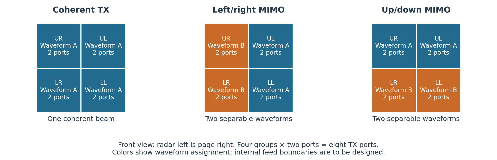
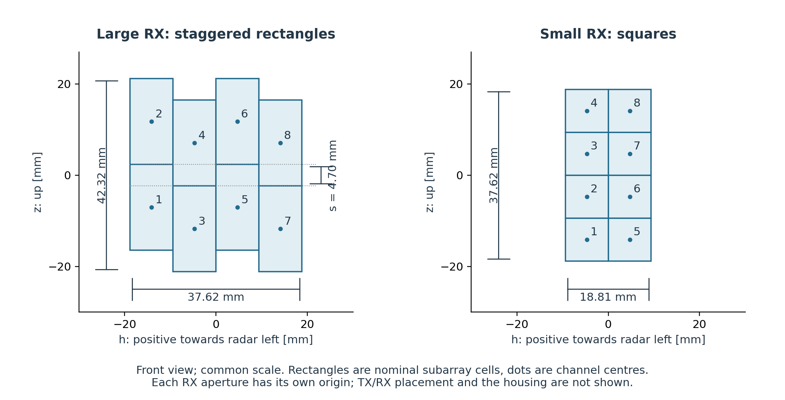
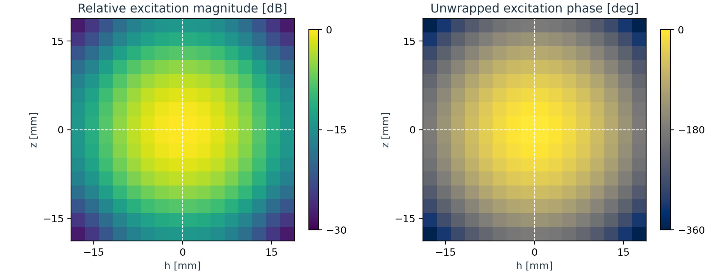
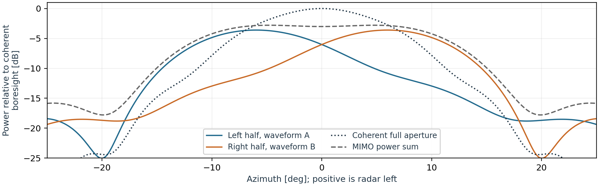

<!--
PDF export from this Markdown, using the existing figures (Pandoc + Typst):
Run from the repository root:

cd studies/2026-09-02_lannik-psi/rfq
pandoc TECHNICAL_DESCRIPTION.md --from=markdown --pdf-engine=typst \
    --template=tools/document.typst --lua-filter=tools/pagebreak.lua \
    --output=TECHNICAL_DESCRIPTION.pdf

To regenerate the figures and both PDFs, run from the repository root instead:
sh studies/2026-09-02_lannik-psi/rfq/tools/build.sh

The template sets the PDF style; the filter handles page breaks and uses SVG
figures in the PDF. This comment is omitted from the rendered document.
-->

# Lannik Psi antenna

**Technical description for RFQ · 17 September 2026**  
Saferadar Research · For supplier discussion and quotation

## 1. Product concept and scope

Lannik Psi is a 76–77 GHz FMCW radar with eight transmit (TX) ports and
eight independent receive (RX) channels. We seek antenna development and
prototype characterization for two variants, using a common TX concept and
different RX layouts. This document describes the intended operation, the
starting design and the information needed to develop it together.

The antenna has two complementary roles: **provide sensitivity for long-range
detection, and provide angular information to resolve ambiguous directions.**
Large RX subarrays improve receive gain, but their channel spacing means that
some different directions produce similar or identical RX responses. The radar
therefore periodically changes how the TX aperture is driven. The resulting
TX responses give the processor additional information about target direction.

### Three operating configurations on the same antenna



In **coherent operation**, all eight ports transmit the same waveform with
nominal phase settings, producing the main sensitivity beam. In **left/right
MIMO**, each half sends a separable waveform; the receiver measures both
responses at every RX channel. **Up/down MIMO** uses the corresponding vertical
split. The two MIMO configurations are interlaced with coherent operation;
the exact timing and waveform implementation are radar responsibilities.

The antenna must support these combinations through its independently fed
aperture groups. Within a waveform group, fields add coherently. The relative
amplitudes **and phases** of the separated group responses vary with direction
and are used by signal processing. Consequently, the individual group patterns
matter alongside the coherent sum beam. This concept does not require an
antenna switching network.

### What we are asking the supplier to quote

Please propose antenna/feed design, simulation, prototype manufacture and
characterization for both RX variants. Identify shared and variant-specific
work, assumptions, exclusions, costs and lead times. We expect an early
technical review of feasibility and predicted patterns, followed by agreement
on detailed targets and verification. Sections 2–4 describe the starting point;
section 5 distinguishes quotation inputs, early design evidence and final data.
Appendices contain coordinate, metric and data-format details.

<!-- pagebreak -->

## 2. Two RX variants and the geometry baseline

Each RX channel receives through its own subarray. The large variant uses
rectangular subarrays in four columns of two channels, with alternating column
heights. The small variant uses square subarrays in two columns of four
channels. Both retain all eight independent RX channels for digital processing.



| Nominal geometry | Large variant | Small variant |
|---|---|---|
| Channel arrangement | 4 columns × 2 channels, staggered | 2 columns × 4 channels |
| Subarray cell, horizontal × vertical | 9.405 × 18.811 mm | 9.405 × 9.405 mm |
| Difference in height between adjacent columns | 4.703 mm | None |
| Overall RX cell envelope | 37.62 × 42.32 mm | 18.81 × 37.62 mm |
| Reference radiators per channel | 4 × 8, uniformly excited | 4 × 4, uniformly excited |

The large variant retains more RX aperture and gain. Its stagger gives ordinary
coherent measurements useful information about some vertical ambiguities.
MIMO remains part of both variants, including for horizontal ambiguity and for
the small variant's vertical ambiguity.

### How to use these dimensions

These dimensions are the **analysis baseline**, derived from Saferadar's
reference radiator layout at approximately 2.351 mm pitch. The cell dimensions and
channel spacings were constructed from that layout; their quoted precision
does not establish manufacturing tolerances. They are neither radiator-edge
measurements nor final mechanical outlines.

We want to preserve the behavior demonstrated by that baseline. **Reasoned
adjustments to dimensions, pitch, radiator construction or feed layout are
welcome for joint evaluation.** Please show proposed changes explicitly,
with their rationale and predicted complex patterns. We will assess the effect
on gain, coverage, resolution and ambiguity before adopting the revised
geometry. Even a small dimensional change should be visible in the design data;
it need not be ruled out in advance.

The diagrams show each RX aperture in its own coordinate system. TX/RX
aperture and subarray dimensions, spacing and feed geometry remain in scope.
Mounting and other mechanical interfaces are defined separately. Approximate
overall dimensions are in section 4; electrical coordinates are in Appendix A.

<!-- pagebreak -->

## 3. TX concept and reference excitation

The starting TX architecture has four independently driven aperture groups,
each fed by two equal-power MMIC ports. The supplier is asked to design the
partition and feed network so that all eight ports can operate at nominal
full power. The baseline uses separately fed aperture regions whose fields
combine; it does not call for an RF combiner joining two MMIC outputs.
Geometrically equal port areas are not necessary.

The reference below uses a tapered amplitude distribution and a smooth
quadratic phase distribution. The phase shaping broadens the coherent beam
and produces different left/right and up/down group responses. Its nominal TX
cell envelope is approximately **37.62 × 37.62 mm**; Appendix A gives the
reference pitch and distinguishes cell dimensions from radiator-centre spans.





In this ideal model, the coherent beam is about 12.6° wide at half power;
the two half beams peak roughly 6° to either side of boresight. The modeled
boresight gain is approximately 23.5 dBi, using an inferred radiator gain.
These figures do not include a verified feed-loss or installed-antenna model.

**The 16 × 16 radiator count, exact pitch, taper law and squint are reference
implementation details.** Alternative implementations can be proposed and
evaluated using the complete patterns. Matching only the sum-beam gain and
width does not establish the required MIMO behavior. The up/down split serves
the same purpose in elevation and must also be characterized.

Tapering should redistribute available power without intentional dissipative
attenuation or systematic TX backoff. Actual feed losses and the directivity
cost of beam broadening must be reported. The reference amplitude taper's
35 dB Taylor parameter is not a guaranteed sidelobe level of the phase-shaped
beam. Appendix A describes the accompanying reference excitation file.

<!-- pagebreak -->

## 4. Baseline, targets and design freedom

**Confirmed operating band:** 76–77 GHz, nominal centre frequency 76.5 GHz.
The front end is the Infineon CTRX8188F with eight TX and eight RX channels.
TX uses equal nominal full power per port with independent phase/waveform
control. Use a common linear polarization for TX and RX: **either vertical or
horizontal, with the choice to be confirmed jointly**.

The architecture and selected RX arrangements form the quotation baseline.
The following numbers are **proposed discussion targets**, for supplier feedback
on achievable performance and tradeoffs. They are not frozen production
acceptance limits. Reference figures and detailed coordinates describe the
starting model, with geometry changes handled as described in section 2.

### Directional performance

All beamwidths below are **full, one-way 3 dB widths**, azimuth × elevation.

| Quantity | TX, common concept | Large RX, per channel | Small RX, per channel |
|---|---|---|---|
| Boresight directivity | ≥23 dBi | ≥21 dBi | ≥18 dBi |
| Approximate beamwidth | 13° × 13° | 20° × 10° | 20° × 20° |
| Realized gain | Report for coherent and both MIMO modes | Report each channel | Report each channel |

Gain and beamwidth must be assessed together. The main TX beam supports
long-range sensitivity; responses around ±12° in the principal planes also
matter for nearer targets and ambiguity resolution. Neither the beamwidth nor
the characterization grid defines a hard product field of view. Report main-beam
shape, sidelobes and nulls in 2-D so that useful two-way coverage can be assessed.

### RF targets and approximate overall dimensions

| Item | Target / indicative dimension |
|---|---|
| Large antenna overall dimensions (indicative) | Approximately 100 × 60 × 10 mm |
| Small antenna overall dimensions (indicative) | Approximately 80 × 70 × 10 mm |
| Port match across the band | Return loss ≥20 dB: `20 log10(abs(S_ii)) ≤ -20 dB` |
| TX–RX isolation | ≥35 dB between every TX/RX port pair |
| TX–TX and RX–RX isolation | ≥15 dB between distinct ports of each type |
| Radiation efficiency | ≥80%, including feed dissipation, referred to accepted input power |
| RX boresight channel gain balance | Each channel within ±1 dB of the channel mean, before calibration |

Please identify targets that materially constrain feasibility or cost. Report
**realized gain at agreed input reference planes**, including feed and mismatch
losses, alongside directivity and efficiency. RX digital combining gain must
be identified separately from single-channel antenna gain. Pairwise isolation
also needs review against active match and total RX leakage with multiple TX
ports driven; supply the relevant coupling data.

Exact mechanical interfaces are covered by separately defined documentation.
For the electrical assessment, state the modeled/measured installation,
temperature, power/duty cycle and sample quantities assumed in the quotation.
Final pattern masks, electrical tolerances and acceptance methods will be
agreed after the preliminary design evidence is available.

<!-- pagebreak -->

## 5. Information and collaboration through the design

We propose the following technical review sequence. Please distinguish the
scope and cost of each phase in the quotation, including measurement work.

### With the quotation: establish the scope and approach

Describe the proposed antenna/feed implementation, compatibility with the
three TX configurations and two RX layouts, and any deviations from the
baseline. Give expected gain/loss and packaging feasibility, the difficult
tradeoffs, and the planned simulation, measurement and calibration methods.
State which assessments are estimates and which already have supporting data.

Detailed new electromagnetic simulations are not assumed to be part of
preparing the quotation. Please identify the development work needed to
produce the early evidence below, the proposed review points, and any
assumptions that could change cost or schedule.

### Early design review: establish that the concept will work

Before committing to fabrication, we need enough information to evaluate the
implemented concept and agree the detailed targets:

- Proposed aperture/subarray dimensions and physical outlines, feed/port
  mapping, relative TX drive phases, and any changes from the baseline.
- **Simulated complex patterns of each TX port and RX channel**, with common
  phase references and defined power normalization, so that we can reconstruct
  the operational modes. Early group-level patterns may support a first
  feasibility review while the internal partition is being developed; the
  actual port patterns are needed when that partition is defined.
- Predicted absolute gain, feed/mismatch losses and relevant S-parameters
  over the band, plus principal pattern behavior and known model omissions.
- Initial sensitivity to dominant manufacturing and calibration errors, and
  a realistic plan for prototype measurements and production calibration.

An agreed small sample data file should establish conventions before the full
export. Sampling and measurement scope can be refined together (Appendix C).
Saferadar will assess two-way gain and competing angular responses for both
RX variants and both MIMO splits, then return the limiting cases for discussion.
Appendix B gives compact diagnostics the supplier may also use during design.

### Final prototype/design delivery: supply the realized antenna description

Provide the **as-built geometry and port mapping**, nominal drive settings,
simulated and measured complex port/channel patterns, absolute gain/loss data
and S-parameters in the agreed formats. Include measurement conditions,
reference planes, calibration/de-embedding, uncertainty, repeatability and
any simulation-to-measurement differences. Identify the tested hardware,
radome/housing configuration, temperatures, unit/sample coverage and revisions.

Explain manufacturing variation, residual drift after calibration and what
must be measured or calibrated per production unit. Full angular measurement
of every production unit is not assumed; propose a practical approach.
If an agreed dataset cannot be measured, identify the gap and propose how the
remaining uncertainty will be bounded and reviewed.

These data will update our range/coverage models and the angle-dependent
responses used by signal processing. Predictable channel differences can often
be modeled; unknown changes between the modeled and actual antenna are more
problematic. We need both the nominal responses and a defensible description
of their variation. Final antenna verification and system integration will use
the agreed criteria; waveform processing and tracking remain Saferadar's scope.

<!-- pagebreak -->

## Appendix A. Coordinate and excitation reference

### A.1 Axes and nominal RX centres

Use `x` forward along boresight, `y` left when looking along boresight and `z`
up. Azimuth is positive left; elevation is positive up. Direction cosines are
`u = sin(azimuth) cos(elevation)` and `v = sin(elevation)`.

The table uses `h = y` and `z`, with a separate origin at each RX aperture's
centre. In a **front view**, looking back at the antenna face, positive `h`
appears to the viewer's right. Document this transformation and channel-to-MMIC
mapping consistently with the separately defined interfaces. Numbers are
logical channel labels.

The reference pitch is approximately `p = 2.351 mm`. Nominal cell dimensions
and spacings are `W = 4p ≈ 9.405 mm` and `H = 8p ≈ 18.811 mm`. For the large
variant, columns in increasing `h` have offsets `(+s/2,-s/2,+s/2,-s/2)` with
`s = H/4 = 2p ≈ 4.703 mm`. The small variant has spacing `W` in both axes.

| Channel | Large h [mm] | Large z [mm] | Small h [mm] | Small z [mm] |
|---|---:|---:|---:|---:|
| 1 | -14.11 | -7.05 | -4.70 | -14.11 |
| 2 | -14.11 | +11.76 | -4.70 | -4.70 |
| 3 | -4.70 | -11.76 | -4.70 | +4.70 |
| 4 | -4.70 | +7.05 | -4.70 | +14.11 |
| 5 | +4.70 | -7.05 | +4.70 | -14.11 |
| 6 | +4.70 | +11.76 | +4.70 | -4.70 |
| 7 | +14.11 | -11.76 | +4.70 | +4.70 |
| 8 | +14.11 | +7.05 | +4.70 | +14.11 |

These coordinates preserve the analyzed baseline. They do not require a
frequency-independent electrical phase centre or prescribe dimensional
acceptance tolerances. Propose tolerances based on their electrical effects;
previous indicative position allowances such as ±0.2 mm have not been
validated as acceptance limits.

### A.2 TX excitation file

The accompanying reference `antenna_arr_77_TX_rev_A.mat` contains MATLAB
variable `antenna_arr`, one row per radiator. Columns 2 and 3 are horizontal
and vertical positions in metres; column 5 is relative complex excitation;
column 6 contains reference group labels. Both excitation magnitude and phase
matter. Confirm position, viewing and phasor conventions when importing it.

The file represents a 16 × 16 radiator layout, approximately 37.62 × 37.62 mm
on a cell-envelope basis (outer radiator centres span approximately 35.27 mm).
It supplies the reference field distribution, **not a finalized eight-port
feed partition**. Its group labels must not be interpreted as binding MMIC
port boundaries. The supplier should propose that partition, nominal relative
port phases and any resulting changes to the fields.

The quoted dimensions originate in this reference representation. There is
no independent requirement for their numerical precision or for the same
radiator count in an alternative realization. Document proposed adjustments
and provide updated patterns for the joint assessment described in section 2.

<!-- pagebreak -->

## Appendix B. Angular discrimination diagnostics

### B.1 Direction-pair correlation

For one MIMO configuration, let `t(d) = [T_1(d),T_2(d)]` contain the two
complex waveform-group fields at direction `d = (u,v)`. Sum the driven port
fields with their nominal amplitudes and phases. Preserve relative group
power; do not independently normalize group peaks. Define

```text
rho_TX(d1,d2) = abs(t(d1)^H t(d2))^2 / (||t(d1)||^2 ||t(d2)||^2)
rho_TX_dB = 10 log10(rho_TX)
```

`H` denotes conjugate transpose. At 0 dB the two responses are proportional
and cannot distinguish the directions with unknown target amplitude/phase.
More-negative values indicate better ideal separation. This is spatial
response correlation, distinct from waveform correlation and port isolation.
Correlation is undefined for a zero-power response; report low-signal cases
explicitly rather than treating them as successful discrimination.

### B.2 Proposed checks for the baseline geometry

At each frequency, define `lambda = c/f`, `a = lambda/(2W)` and
`b = lambda/(2H)` using Appendix A. At 77 GHz, `(a,b) ≈ (0.20698,0.10349)`;
at 76.5 GHz, approximately `(0.20833,0.10417)`. These are direction cosines.

| Direction pair (u,v) | MIMO split | Proposed rho_TX limit | Ideal 77 GHz reference |
|---|---|---:|---:|
| (+a,0) / (-a,0), both RX variants | Left/right | ≤ -2.5 dB | -3.1 dB |
| (0,+a) / (0,-a), small RX | Up/down | ≤ -2.5 dB | -3.1 dB |
| (0,+b) / (0,-b), large RX | Up/down | ≤ -10 dB | -29.3 dB |

These are **discussion targets across 76–77 GHz**, not a complete acceptance
test. Reference results use ideal 77 GHz excitation weights and do not verify
physical performance across the band. Report directional group-power sums
with each correlation. Update the evaluation directions when geometry changes;
for the staggered layout, the old vertical alias is already a near-alias.

### B.3 System assessment and robustness

Saferadar will evaluate the full response `A[g,r](d) = T_g(d) R_r(d)`, using
actual RX patterns and receiver-noise weighting. At exact ideal RX aliases,
TX correlation describes the remaining discrimination. Elsewhere, including
staggered RX and displaced competing lobes, the full response is needed.

Correlation is considered alongside received signal strength. For a fixed
single-target signal, a useful diagnostic in whitened noise is
`D(d1 -> d2) = SNR(d1) * (1-rho_full(d1,d2))`, with linear SNR. It measures
signal energy not explained by the wrong direction after fitting complex
amplitude. It is not a correct-resolution probability. Evaluate both directions
of a pair because their gains can differ. At -10 dB, `1-rho = 0.90`; pursuing
the reference's very deep minimum is less important than preserving useful
signal and separation across the relevant region.

The review searches competing lobes in 2-D, excluding local angle-estimation
offsets, and states any gain/target-strength screening. It includes actual
responses processed with the intended calibrated model, not only correlations
computed with perfect knowledge of each antenna. A ±15° residual phase budget
between alternating RX column groups is an initial system target to evaluate,
not a raw antenna tolerance. Coverage, wrong-cell probability, latency and
remaining calibration budgets are system-level decisions still to be finalized.

<!-- pagebreak -->

## Appendix C. Pattern and characterization data

The following describes the intended early simulation and final delivery data.
Agree the export schema using a small sample file and identify achievable
measurement scope, limitations and costs in the proposal.

### C.1 Reference conventions and contents

- Provide complex embedded fields for each of eight TX ports and eight RX
  channels, including co- and cross-polar components. State the other-port
  terminations and reference impedance. Use a common spatial origin and
  consistent amplitude/phase references across ports, with defined units,
  input-power normalization, phasor convention and polarization basis.
- Preserve spatial phase and relative magnitude. Do not independently recenter
  or peak-normalize port patterns. State reference planes, fixture removal,
  calibration/de-embedding and any correction from measurement to operational
  loads. RX data may use reciprocal transmit measurements with the conversion
  convention documented.
- Supply machine-readable data as well as plots, indexed by hardware revision,
  port/channel, frequency, direction, polarization and test condition. Identify
  simulated and measured datasets separately. Document any omitted feed,
  coupling, radome or housing effects.
- From nominal drive settings, provide the coherent sum beam, both MIMO group
  fields and their power sums. Compare modes at the same total incident TX
  power with their physical allocation retained. Include absolute directivity,
  realized gain, efficiency, beamwidth, sidelobes and nulls, and relevant
  S-parameters including TX–RX coupling.

### C.2 Initial sampling proposal

For detailed patterns, start with `|u|, |v| ≤ 0.6` at spacing no coarser than
0.005 in each coordinate, at 76, 76.5 and 77 GHz. Equivalent angular grids or
a demonstrated accurate interpolation method can be agreed. These are
characterization coordinates, not a promised product field of view.

Include broader forward-hemisphere sidelobe/grating-lobe coverage at a suitable
coarser spacing and refine significant lobes. Supply swept S-parameters across
the band and additional pattern frequencies wherever dispersion or resonances
require them. Three sampled frequencies alone cannot establish performance
between them. An early reduced dataset is useful when its limits are stated;
agree final coverage and uncertainty before the measurement campaign.

### C.3 Variation, calibration and final interpretation

Distinguish constant complex port offsets, calibratable frequency dependence,
and residual angle-dependent or time/temperature-dependent changes. Known
repeatable differences can be represented in our models and processing.
Calibration cannot recover lost signal power or eliminate unmodeled pattern
changes; gain and model accuracy both matter.

Provide sensitivity to dominant feed, radiator, assembly and temperature
variations, including correlated group errors. State measurement dynamic range
and uncertainty; relative amplitude/phase tolerances at deep pattern nulls are
not meaningful. Port phase errors within a coherent TX group can change the
radiated pattern itself.

For final delivery, relate measurements to the as-built geometry and the
proposed production calibration. Identify the sample count and tested conditions,
remaining unmeasured variation, and which response parameters require per-unit
calibration. Clearly separate bare-antenna predictions from measured or modeled
installed behavior. These distinctions are needed to update system models and
implement the correct angle-dependent response in signal processing.
