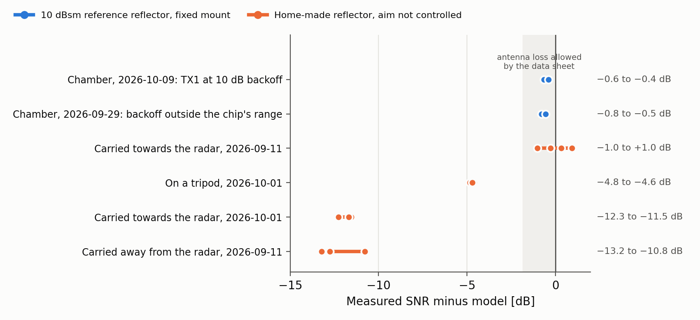
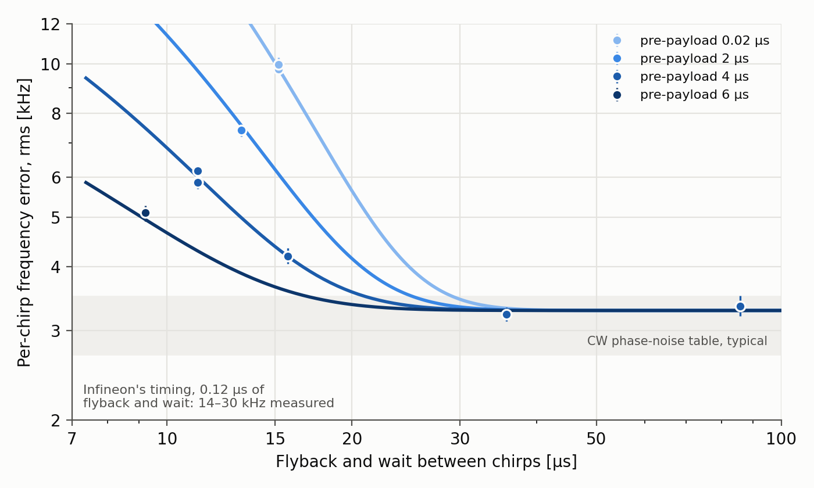

# CARKIT validation: what the measurements tell us

2026-09-11 to 2026-10-10 · concluded · Patrik Andersson (analysis), Viktor Kärnstrand
(measurements)

*Internal. This report quotes figures from Infineon's CTRX8188F target
datasheet and user manual, which we hold under NDA.*

We checked our range model against measurements with CARKIT, Infineon's
evaluation radar for the CTRX8188F MMIC (76–81 GHz, eight TX and eight RX
channels), which Lannik Psi will also use. The model is the radarperf
toolbox's radar equation with datasheet values. We also checked how the LO's
phase noise behaves. CARKIT carries HUBER+SUHNER's SENCITY FARAD-IV waveguide
antenna behind a radome, the closed unit's housing cover. Lannik Psi has the
same MMIC on our own PCB, with its own antenna. All measurements used our
single CARKIT unit, first with Infineon's firmware and, from late September,
with our own.

This page gives the results and what follows from them.
[NOTES.md](NOTES.md) holds the analysis behind each statement.

## In brief

- **The radar equation with datasheet typical values holds to within about
  1 dB.** In a measurement chamber, with a 10 dBsm reference reflector on a
  fixed mount, CARKIT comes out 0.4–0.7 dB below the model. A corner reflector
  carried towards the radar agrees with that to within about 1 dB. No
  empirical correction to the model is called for.
- **Reflector measurements are only as good as the reflector's aim.** The same
  home-made reflector came out about 5 dB below the model on a tripod in a
  later session, and 11–13 dB below it when carried in that session or carried
  away from the radar in the first. A trihedral loses 3–11 dB at 20–30° off its
  axis. Absolute checks need reflectors on fixed mounts, aimed along a sight.
- **The receiver's noise rises towards low IF by more than the datasheet
  says**, about 0.8 dB from 5.3 to 1.25 MHz against 0.2 dB from 10 to 1 MHz.
  At the IFs of long-range targets, a flat noise figure at the datasheet's
  10 MHz value fits.
- **The LO's per-chirp frequency error is at the level the datasheet's CW
  phase noise predicts, 3.1–3.6 kHz rms, if the synthesizer gets enough time
  between chirps.** With too little time it grows: 1.8 times larger at our
  firmware's shortest chirp period, and 4–9 times with Infineon's chirp
  timing. The time between chirps is therefore a design parameter: about
  15–25 µs with a 10 µs sampled ramp, where the datasheet gives 1 µs for the
  synthesizer's flyback.
- **A strong return raises the noise floor at all ranges**, through the LO's
  phase noise far from the carrier, at about the CW table's level. In a
  chamber this, not thermal noise, limits what coherent channel summation
  gains, so a channel-summation gain measured there says nothing about range
  performance.
- **The rest behaves as configured:** range scale, TX backoff, the coherent
  eight-TX beam, and the channels' phase calibration, which holds between days
  and firmwares.

## What was measured

| Set-up | Dates | Firmware | Used for |
|:-----------------------------------|:-----------|:----------|:----------------------|
| A 10 dBsm reference reflector (Microwave Factory) on a fixed mount at 2.2–2.5 m in a measurement chamber, with TX1, all eight TX in turn and the eight-TX beam | 2026-09-29, 2026-10-09 | ours | Absolute sensitivity; receiver noise; a strong return's phase noise; TX powers and channel calibration |
| A home-made trihedral (100 mm inner edge) carried towards the radar from 50 m and back, the radar on a tripod | 2026-09-11 | Infineon's | Sensitivity; receiver noise; the per-chirp error |
| The same kind of reflector on a tripod at six distances from 4 to 90 m on a grass field, each with two chirp slopes; then carried towards the radar; TX off | 2026-10-01 | ours | Sensitivity; whether the low-IF background is noise or gain shape |
| A reflector held at 5 and 10 m | 2026-09-22 | Infineon's | The per-chirp error |
| The static scene out of the office window to about 500 m, the last two times from a fixed mount, the last with ten chirp timings | 2026-08-27 to 2026-10-06 | both | The per-chirp error and what sets it; TX backoff, the eight-TX beam, range scale |
| Traffic on a motorway seen from a bridge, to 1.2 km | 2026-10-01 | ours | Interference from other radars |

CARKIT's radome cannot be removed, so every measurement includes its loss,
which is not known.

## Sensitivity against the model

The model takes the CTRX8188F datasheet's typical TX power and noise figure,
the FARAD-IV antenna's directivity (about 15 dBi) and the processing's window
losses. It leaves out all hardware losses. The noise figure is the typical
value at the RX gain step the captures used: 9.7 dB at +3 dB gain, or 10.2 dB
at the chip's default 0 dB.



*Measured SNR minus the model's, with the noise taken at 5.3 MHz IF, where the
receiver's noise is flat. Each dot is one estimate: two ways of taking the TX
backoff or the high-pass filter in the chamber, four ways of averaging the
CPIs for the carried reflector, four tripod placements, and three range bands
for each of the last two rows. The shaded band is how far the antenna's realized gain
may fall below its directivity on the two passes, according to its data
sheet ([generated/report/](generated/report/summary.json),
[report_figures.py](report_figures.py)).*

**Chamber, reference reflector on a fixed mount: 0.4–0.7 dB below the model.**
TX1 transmitted at 10 dB backoff, measured as 9.7 dB on the reflector. A steep
chirp put the reflector at 1.3 MHz, above the receiver's high-pass filter. A
second capture at full power, with the reflector inside the high-pass and
corrected by the filter's measured response, gives the same result within
0.1 dB. An earlier session, with a TX backoff outside the chip's specified
0–15 dB, gives the same at face value.

At 2.2 m the radar equation needs one correction. A corner reflector sends its
return back in a beam only about 13 cm wide at the radar, to half power,
centred on the transmitter. CARKIT's receivers sit 5–7 cm from TX1, so they see
1.8–3.3 dB less than a receiver at the transmitter would, 2.2 dB on average.
A finite-aperture model of the reflector gives this, the same model l2-sp uses
for the antenna's phase centres. Without the correction the chamber would
read 2.6–2.9 dB low. The same effect explains about half of the spread
between the eight TX's apparent powers in a chamber calibration
([The chamber reflector](NOTES.md#the-chamber-reflector),
[A reflector at short range](NOTES.md#a-reflector-at-short-range)).

**Carried towards the radar: within about 1 dB of the chamber.** The
home-made reflector's RCS comes from a lab comparison with the reference
reflector at 2.2–2.5 m. After the same correction, which costs the larger
reflector 0.85 dB more, its RCS is about 12.1 dBsm. Carried towards the radar
over 17–51 m, it comes out +0.3 dB against the model, and between −1.0 and
+1.0 dB depending on how the CPIs are averaged. The level fluctuates and rises
by about 2 dB over the range used.

**On a tripod, and carried again: setup, not radar.** In a later session the
same reflector on a tripod came out 4.4 dB below its carried level, 4.6–4.8 dB
below the model. Carried towards the radar in that session, it came out a
further 7 dB lower, as low as the first session's reflector carried away from
the radar. The static scene shows that the radar pointed during the first
carried runs as it did for the tripod placements, so the 7 dB lies with the
reflector and how it was carried. The receiver noise at the ADC was the same in both sessions to
0.12 dB, which rules out a change of gain after the receiver's first stages.
Both chamber sessions, with two builds of our firmware, put the radar within
1 dB of the model, so the radar side is unlikely to have lost 4 dB on the
tripod. The likely causes lie in the setup:

- the reflector's aim;
- the radar's elevation pointing, where a tilt of 6–7° would do it;
- which of our two home-made reflectors was used, since they are not marked.

**A corner reflector's return falls steeply off its axis.** For an ideal
triangular trihedral turned by θ off its axis, the return falls by
[(3 cos²θ − 2)/cos θ]², in any direction to about 22° and towards a plate all
the way to its zero:

| Off the axis | 10° | 20° | 25° | 30° | 35.3° |
|---|---:|---:|---:|---:|---:|
| Loss | 0.7 dB | 3.2 dB | 5.8 dB | 10.8 dB | no return |

On the reflector's 100 mm edge, 10° is 17 mm. A reflector carried at waist
height, or set by eye on a tripod head, has nothing to sight along. Carried
reflectors therefore cannot serve as a reference for absolute levels
([The reflector's aim](NOTES.md#the-reflectors-aim),
[The reflector carried in the field](NOTES.md#the-reflector-carried-in-the-field)).

**The hardware losses are below what these measurements resolve.** By its
data sheet, the antenna's realized gain is up to 0.9 dB below its directivity
on each pass. The radome adds an unknown loss. These terms are comparable to the
datasheet's spread of TX power between units (±1.5 dB) and to the reference
reflector's RCS, which its maker states without a tolerance. So the
measurements cannot calibrate them, and the toolbox should take them from
their sources ([Loss terms](NOTES.md#loss-terms)).

## The receiver's noise at low IF

The receiver's background rises by about 1.2 dB from 20 MHz IF down to 1 MHz.
It belongs to the receiver. It is the same with the transmitter off, with
10 dB less TX power and with nothing in view, and it is independent between
the RX channels.

To separate noise from the IF gain's shape, we captured a reflector held still
with two chirp slopes in the same RF band, which moves it to twice the beat
frequency and changes nothing else. Gain shape would leave the SNR unchanged;
noise would not. From 1.25 to 5.3 MHz the SNR rises by 0.8 dB, about as much
as the background falls, so the rise there is noise. From 7 to 14 MHz it does
not rise (−0.3 ± 0.2 dB).

The datasheet's noise figure, specified under the same conditions (TX off,
300 kHz high-pass, +3 dB gain), rises only 0.2 dB from 10 to 1 MHz. Whether
this unit is noisier at low IF than a typical part, or the target datasheet's
typical values are optimistic, is open.

At the IFs of long-range targets, a flat noise figure at the datasheet's
10 MHz value fits. At the chip's default 0 dB gain step, the noise at the ADC
is 2.3–2.9 dB lower than at +3 dB, close to the 2.5 dB the datasheet's gain
and noise-figure steps give. The high-pass filter measures as two poles at
294 kHz, within the datasheet's 300 kHz ± 10 %
([The receiver background](NOTES.md#the-receiver-background)).

## The per-chirp frequency error

Phase noise of the LO makes a return's phase vary from chirp to chirp. For a
return at round-trip delay τ, the variation is 2πτ·δf. Here δf is an equivalent
frequency error per chirp, the same for all returns: the LO's frequency error
averaged over the chirp's sampled ramp. We quote δf as its rms over chirps.

Between chirps the synthesizer flies back to the start frequency (the flyback)
and may wait, both in a fast-settling mode. It then starts the next ramp,
whose first part, the pre-payload, is not sampled.



*δf from static returns out of the office window, with the radar on a fixed
mount and a 10 µs sampled ramp, against the time in fast-settling mode, for
four pre-payloads. Bars span the 5th to 95th percentiles; lines are the
settling fit. The shaded band is δf computed from the CTRX8188F's typical CW
phase-noise table for the same waveforms
([Window: the chirp timing sets the error](NOTES.md#window-the-chirp-timing-sets-the-error)).*

- **With enough time between chirps, δf is 3.1–3.6 kHz rms.** That is around
  the CW table's typical prediction (2.7–3.5 kHz) and below its maximum
  (4.8–6.1 kHz). Its spectrum over the chirps is flat, as the table predicts.
- **With less time it grows, and the time in fast-settling mode and the
  pre-payload are what count.** The flyback's own length does not matter. The
  excess over the floor halves with every 2.4 µs of flyback and wait, or every
  1.2 µs of pre-payload. To stay within 10 % of the floor with a 10 µs sampled
  ramp, flyback and wait need 24, 20 or 15 µs at a pre-payload of 2, 4 or
  6 µs. That gives a chirp period of 32–36 µs. Our firmware's shortest period
  for this waveform, 25.5 µs, gives 5.9 kHz.
- **That explains Infineon's 14–30 kHz.** Infineon's configurations allowed
  0.12 µs of flyback and wait. The fit, extrapolated that far, predicts 29, 24
  and 16 kHz at their three pre-payloads, against 30, 22 and 14–19 kHz
  measured on the same unit. The extrapolation is uncertain by a factor of
  about 1.5 either way, but it needs nothing else to explain the measurements.
  By the same fit, lengthening the flyback to the datasheet's 1 µs would
  barely help (21 kHz).
- **It behaves as an LO error.** It is common to all RX channels and pure
  phase, and it does not depend on the chirp slope. Its phase grows with the
  delay, as one δf for all returns requires, to at least 270 m. Where the
  timing raises it, the excess rises towards half the chirp rate. That fits a
  synthesizer that has not settled from one ramp when the next begins.
- **A longer sampled ramp averages it down.** With a 41 µs ramp δf is at most
  0.56 kHz, where 0.43–0.51 kHz is predicted.
- **At 1 km, 3.3 kHz costs about 0.1 dB of Doppler integration gain**
  (0.14 rad rms per chirp). The phase error keeps the Doppler FFT from adding
  the chirps fully in phase, so a share of the target's energy leaves its
  Doppler cell and spreads into a pedestal over Doppler. This is a loss across
  chirps, in every channel alike, not across channels. 5.9 kHz costs 0.26 dB,
  and Infineon's timing would cost 1.5–7 dB. Around strong returns the
  pedestal can stand well above the noise; the link budget carries the loss
  but does not model the pedestal.

## A strong return's phase-noise skirt

The LO's phase noise far from the carrier does not stay at the return's
range. Within each chirp it spreads into every range cell, independently from
chirp to chirp. It is therefore white over Doppler and carries the return's
own spatial signature in the RX channels.

With the reference reflector at 2.5 m in the chamber, it lifted the background
at all ranges:

| Configuration | Floor lift |
|---|---:|
| TX1 | 0.02 dB |
| All eight TX in turn | 0.2 dB |
| The eight-TX beam, 19 dB stronger than TX1 | 1.9 dB |
| The beam, 10 dB more TX power | 8.3 dB |

Relative to the reflector, the skirt is flat from 1 to 12 MHz offset. It sits
2.3–3.1 dB below the level the CTRX8188F's typical CW table gives, so the
toolbox's single-return phase-noise model is slightly pessimistic. Closer to
the carrier, at 0.3–0.5 MHz, it lies between the table's typical and maximum.

Because the skirt has the reflector's spatial signature, summing the RX
channels coherently raises it as much as the reflector. Against the same
captures' background, coherent summation over the eight RX gains 8.9 dB with
TX1 but only 3.0 dB with the strongest beam, where independent noise would give
9.0 dB. A channel-summation gain measured in a chamber therefore says nothing
about range performance
([A strong return's phase-noise skirt](NOTES.md#a-strong-returns-phase-noise-skirt)).

## Scale, gain, calibration and interference

- **Range scale:** for moving vehicles, the change in apparent range matches
  the distance their Doppler speed gives to within 1 %.
- **TX backoff:** 10 dB less TX power lowers the scene by 10.0 dB, and the
  reflector in the chamber by 9.7 dB.
- **The eight-TX beam:** calibrated, it adds 17.5 dB at a strong return,
  against 18.1 dB at the beam's peak if ideal. In the chamber it adds what the
  eight TX's amplitudes allow, to within 0.1 dB.
- **TX powers:** at a valid backoff, the TX's relative powers match Viktor's
  earlier lab measurement to 0.2 dB rms.
- **Phase calibration:** the RX calibrations of three sessions over ten days,
  and one made with Infineon's firmware, differ only as slightly different
  directions to the reflector would make them. The TX calibrations agree to
  0.6° rms within a day and to 2–5° rms between days.
- **Calibration over frequency:** the calibration phases change with RF
  frequency by up to 75° per GHz. These are fixed delays between the channels
  of up to 0.2 ns.
- **Interference:** near traffic, other radars interfere in up to about a fifth
  of a capture's CPIs. The analysis drops those CPIs.

Details are in [Scale, gain and interference](NOTES.md#scale-gain-and-interference).

## What it means for our models

- **Keep the datasheet's typical values, at the RX gain the firmware sets.**
  For the CTRX8188F at +3 dB gain, that is a 9.7 dB noise figure at 10 MHz IF
  (`frontend.ctrx8188f(noise_figure_db=9.7)`). The preset's 10.2 dB is the
  chip's default 0 dB step. Take hardware losses (antenna efficiency and
  mismatch, radome) from their sources, not from these
  measurements.
- **A flat noise figure fits from about 5 to 14 MHz IF.** Where targets of
  interest sit below 5 MHz, `SystemLosses.noise_figure_derating_db` can carry
  the low-IF rise, up to about 0.8 dB at 1.25 MHz.
- **No empirical phase-noise term is needed where the chirps have enough time
  between them.** The CW table then predicts δf, and
  `SystemLosses.chirp_frequency_error_rms_hz` carries the Doppler integration
  loss it causes. For
  tighter timing, the same field takes δf from the timing test's settling fit.
  The fit was measured on one unit with a 10 µs sampled ramp, and its delay
  law to 270 m.
- **One δf rms sets the Doppler integration loss, but not the pedestal around
  strong returns.** The pedestal needs the error's spectrum over the chirps.
- **The single-return phase-noise model predicts a strong return's skirt**
  from the CW table, 2.3–3.1 dB pessimistic at 1–12 MHz offset. It can budget
  how far strong near returns lift the floor.

## What it means for Lannik Psi

- **Chirp timing is part of the waveform design.** With a 10 µs sampled ramp,
  δf stays at its floor once flyback and wait reach 15–25 µs, depending on
  the pre-payload. A microsecond of pre-payload is worth about two of wait. The
  3.5 kHz assumed in the Lannik Psi study, with its 20 µs ramp, is
  conservative if the chirps get that time. Whether a 20 µs ramp settles in the
  same time is not measured, so a Psi waveform with a short chirp period
  should be tried on CARKIT first.
- **Set the RX gain to +3 dB explicitly.** The chip defaults to 0 dB, whose
  typical noise figure is 0.5 dB higher, and so does our host tool unless the
  waveform asks for +3 dB.
- **The low-IF noise excess matters little at long range.** With an assumed
  2 MHz/µs slope, 5 MHz IF is 375 m, and 500–800 m sit at 6.7–10.7 MHz.
- **The radome needs its own measurement.** CARKIT's radome cannot be
  removed, so these results bound nothing about Psi's.
- **Strong returns near the radar raise the floor for every target.** Mounting
  structure or clutter close to the radar carries the LO's phase noise into all
  range cells. How much it costs depends on the installation; the
  single-return phase-noise model can budget it.
- **Interference from other radars has to be handled** near traffic: up to a
  fifth of the CPIs here. The Aurix's user manual lists time-domain
  interference detection and removal among its signal processing unit's
  features, which is worth looking into.
- **Keep the TX backoff within the chip's 0–15 dB.** Our host tool accepts up
  to 20 dB. On CARKIT, 20 dB shifted seven of the TX by 1.25 dB against TX1
  compared with 10 dB.
- **Calibrate the channels' phases over the band in use, or model their
  delays.** A calibration at one frequency is off by up to 38° half a gigahertz
  away.

## For future measurements

- **Mount the radar and the reflectors, and aim the reflectors along a sight**
  on their axis. Keep carried reflectors for what does not depend on level,
  such as the per-chirp error. A sphere, whose RCS does not depend on aim, is
  an option for later.
- **Correct short-range reflector measurements for the reflector's finite
  aperture.** At 2–3 m it weakens the return at receivers a few centimetres
  from the transmitter, by an amount that differs between TX–RX pairs and
  between reflector sizes. That bias carries into channel gains calibrated
  there and into RCS ratios measured there.
- **Keep the reflector's beat frequency above the high-pass filter.** Its two
  poles near 300 kHz, with ±10 % on the corner by the datasheet, take 12–13 dB
  off a reflector at 2.2 m with an 11 MHz/µs chirp. In a chamber as short as
  ours, a steep chirp does it: 88 MHz/µs put the reflector at 1.3 MHz. A
  longer chamber would ease this and the finite-aperture correction alike.
- **Measure the noise at the reflector's own beat frequency**, from cells
  without targets next to it, or state the IF it refers to. The receiver's
  noise changes with IF, and noise taken far out in the range spectrum
  flatters the SNR.
- **Record the full MMIC configuration and a setup log with every capture.**
  This covers the synthesizer and high-pass settings, the host tool's version
  with any uncommitted changes, the mounting, distances and which reflector.
  Reconstructing these after the fact held up several conclusions here.
- **Expect interference near traffic.** Traffic is still useful, as a stream
  of targets to detect and track; flag the interfered CPIs and drop them, as
  this analysis does, or remove the interference in the time domain.

## Still open

1. **Why the tripod session came out 4–5 dB low:** the reflector's aim, the
   radar's pointing, or which reflector it was. Both home-made reflectors and
   the reference reflector, measured in turn on one fixed mount at 15–35 m,
   would show it.
2. **How the settling scales with a longer sampled ramp**, such as Psi's
   20 µs, and whether the transfer of each chirp's data adds to the effect of
   a short chirp period. A few more chirp timings out of the window would
   settle both.
3. **The receiver's IF response above 5 MHz.** One less clean pair of
   captures says the background's fall from 7 to 14 MHz is gain shape. Above
   14 MHz, where a 3 MHz/µs slope puts 1 km, it is not measured.
4. **Whether the low-IF noise excess is this unit or the datasheet**, which
   Infineon, warm-up captures with the TX off, or a second unit could answer.
5. **CARKIT's radome loss**, unknown in every comparison with the model.

The measurements that would close them are listed in
[Open questions and next measurements](NOTES.md#open-questions-and-next-measurements).

## Earlier results

A conclusion posted on 2026-09-29, that the LO's per-chirp error lies 8–12 dB
above the datasheet and could reach 0.7 rad at 1 km, held only for Infineon's
chirp timing. A first analysis of the carried reflector, 4 dB above the model,
mostly reflected the reflector's RCS, the noise reference and the noise figure
assumed.

## Documents and reproducing

| File | Contents |
|:------------------|:-------------------------------------------------|
| [NOTES.md](NOTES.md) | The measurements, the analysis behind every result above, open questions and next measurements |
| [report_figures.py](report_figures.py) | This page's two figures, from the tracked summaries |
| [generated/](generated/) | Each step's `summary.json` and the figures the notes link to |
| [inputs/](inputs/) | Viktor's lab report of 2026-09-22 and his figures of the reflector comparison |
| [deliverables/](deliverables/) | What was posted outside the repository |

The raw captures are on the shared drive, not in the repository. Unzipped
into one folder, they regenerate every result with

```sh
make study_260911_carkit_validation CARKIT_DATA_ROOT=/path/to/carkit
```

in about 10 minutes ([Reproducing](NOTES.md#reproducing)). The report's
figures need only the tracked summaries:
`venv/bin/python studies/2026-09-11_carkit-validation/report_figures.py`.
