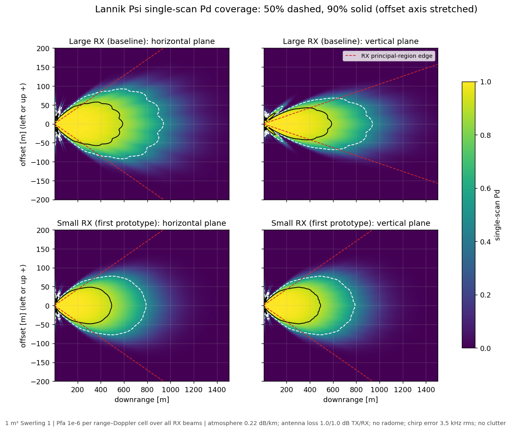
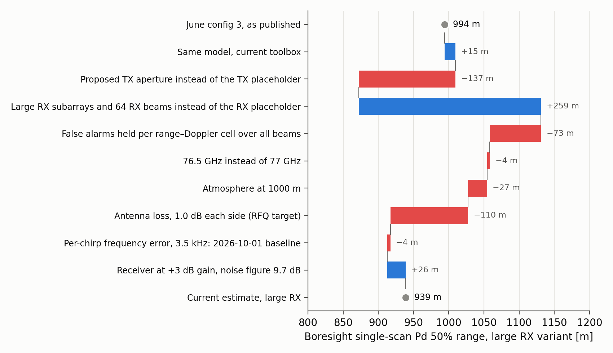

# Lannik Psi: expected range performance

October 2026 · before the antenna supplier's design data · Patrik Andersson

*Internal. This page quotes figures from Infineon's CTRX8188F datasheet, which
we hold under NDA.*

Lannik Psi is our 76–77 GHz radar for drone interceptors, built on Infineon's
CTRX8188F radar chip with eight transmit (TX) and eight receive (RX) channels.
This page gives our current estimate of how far it detects a small target, how
that compares with what we said in June, and how far we can trust it now that
we have measured the same chip on Infineon's evaluation radar, CARKIT. The
antenna design is with a supplier. Their design data will replace some of the
assumptions here, and the estimate will be updated when it arrives.

## In brief

- **About 940 m straight ahead.** With the larger of the two receive antennas
  under development, a target of 1 m² radar cross-section is detected in a
  single frame with 50 % probability out to 939 m on boresight, and with 90 %
  out to 588 m. The smaller receive antenna, ordered first as the prototype,
  reaches 789 m. Six degrees off boresight the ranges are 643–766 m.
- **About 5 % less than the June estimate of 994 m.** June used placeholder
  antennas and no losses. Real antenna designs, a stricter false-alarm budget,
  and the antenna and atmospheric losses brought the estimate to 913 m by the
  end of the antenna study. Running the receiver at its +3 dB gain setting,
  which is now settled, adds 26 m.
- **The model holds up against measurements.** On CARKIT, the radar equation
  with the chip's datasheet values came out within 1 dB of a measurement
  against a reference reflector, about 5 % in range.
- **The main uncertainties are the antenna's losses, the radome and the spread
  between chips.** The antenna losses here are the design targets we gave the
  supplier. Each 0.1 dB of radome loss, each way, costs about 1 % of range,
  and a chip at the datasheet's worst-case noise figure about 15 %.
- **Two design rules came out of the measurements.** The radar must leave the
  chip's synthesizer enough time between chirps, and it must set the receiver
  gain to +3 dB explicitly.

## What the numbers mean

- **Single-scan detection probability (Pd)** is the probability of detecting
  the target in one frame. We quote the range where it reaches 50 %, which a
  tracker can follow, and 90 % for comparison.
- **The target** is 1 m² and fluctuates from frame to frame (Swerling 1).
- **False alarms** are held at one in a million per range–Doppler cell over all
  receive beams. With 512 range and 512 Doppler cells per frame, that is about
  0.26 false alarms per frame, or about 5 per second at an assumed 20 frames
  per second. It is a placeholder until the false-alarm rate the tracker can
  accept is set.
- **The radar model** takes the chip's typical datasheet values (14.5 dBm TX
  power per channel, 9.7 dB receiver noise figure at +3 dB gain), ideal
  antenna models with 1.0 dB loss on each side (the targets in our request for
  quotation), the standard atmosphere at 1000 m altitude, the lowest altitude
  of the customer's use cases, and a small loss for the chip's phase noise. It
  leaves out the radome, rain and clutter.

We do not quote the probability of acquiring a track. It depends on the
confirmation rule, the frame rate and how the target approaches, none of which
is defined yet. A confirmed track forms further out than single-scan Pd
suggests, so single-scan Pd is the conservative measure.

## Coverage

*Probability of detecting a 1 m² target in one frame, by position, for the
large receive antenna (top) and the small one (bottom), in the horizontal
(left) and vertical (right) planes. The dashed contour is 50 %, the solid one
90 %. The red dashed lines mark the edges of the region the receive array
resolves without ambiguity.*

| Direction | Large RX: Pd 50% / 90% | Small RX (first prototype): Pd 50% / 90% |
|:------------------|---------------:|---------------:|
| Boresight | 939 / 588 m | 789 / 493 m |
| 6° horizontally | 766 / 478 m | 643 / 401 m |
| 6° vertically | 646 / 403 m | 643 / 401 m |

The beam is narrow by design: it trades width for gain. Six degrees is about
the half-width of the TX beam. The large variant's taller receive antennas
narrow its vertical coverage to the small variant's at 6°.

## Compared with June

*Each bar is one change to the model, in the order they were made, applied to
the bar above. Blue lengthens the range, red shortens it.*

The June configuration comparison estimated 994 m on boresight for this
configuration with 17 dBi placeholder antennas, no losses and a false-alarm
probability per receive beam. Since then:

- **The antennas became real designs.** The proposed TX antenna widens its
  beam on purpose, which costs 2.5 dB against the placeholder. The large
  receive antennas more than make up for it, by 4.5 dB.
- **False alarms are now counted over all 64 receive beams** rather than per
  beam, which costs 1.2 dB.
- **Losses are now explicit:** 1.0 dB of antenna loss on each side, the
  atmosphere at 1000 m and the move to 76.5 GHz, together 2.5 dB.
- **The receiver runs at +3 dB gain**, whose noise figure is 0.5 dB lower.

| Step | Pd 50% / 90% | Change in Pd 50% range | Equivalent SNR |
|:-------------------------------------------|--------------:|--------:|---------:|
| June config 3, as published | 994 / 614 m | | |
| Same model, current toolbox | 1009 / 623 m | +1.6% | +0.27 dB |
| Proposed TX antenna instead of the placeholder | 872 / 538 m | −13.6% | −2.54 dB |
| Large RX antennas and 64 receive beams instead of the placeholder | 1131 / 698 m | +29.7% | +4.51 dB |
| False alarms per range–Doppler cell over all beams | 1058 / 655 m | −6.4% | −1.15 dB |
| 76.5 GHz instead of 77 GHz | 1054 / 653 m | −0.4% | −0.06 dB |
| Atmosphere at 1000 m | 1028 / 642 m | −2.6% | −0.45 dB |
| Antenna loss, 1.0 dB each side | 917 / 573 m | −10.7% | −1.97 dB |
| Phase-noise loss, 3.5 kHz per-chirp error: end of the antenna study | 913 / 572 m | −0.5% | −0.09 dB |
| Receiver at +3 dB gain, noise figure 9.7 dB: **current estimate** | **939 / 588 m** | +2.9% | +0.49 dB |
| Small RX antenna instead, same assumptions | 789 / 493 m | −16.0% | −3.02 dB |

The equivalent SNR is the change in signal-to-noise ratio that would move the
range as much under the radar equation's fourth-power law, 40 log₁₀ of the
range ratio. In total the current estimate is 5.5 % below June's, 0.99 dB.
The antenna study's own table differs from this one by a metre or two in some
rows, from later refinements of the false-alarm calculation.

## What the CARKIT measurements add

We measured CARKIT, Infineon's evaluation radar with the same chip, against
our model from September to October
([the CARKIT validation report](../2026-09-11_carkit-validation/README.md)):

- **The radar equation with datasheet values is right to within about 1 dB.**
  With a reference reflector on a fixed mount in a measurement chamber, CARKIT
  came out 0.4–0.7 dB below the model. CARKIT has a different antenna and its
  own radome, so this confirms the chip and the model, not Psi's antenna.
- **The receiver's +3 dB gain setting behaves as the datasheet says.** The
  chamber result above was at +3 dB with the datasheet's 9.7 dB noise figure,
  and switching to 0 dB changed the receiver noise as the datasheet predicts.
  Infineon confirmed that the datasheet's two noise modes are these gain
  steps. Psi will run at +3 dB, so the estimate now uses 9.7 dB instead of the
  chip default's 10.2 dB.
- **The phase-noise allowance holds if the chirps are timed with margin.**
  With a 10 µs ramp, the chip's synthesizer needed about 15–25 µs between
  chirps to settle, far more than its datasheet suggests. With that, the
  per-chirp frequency error was 3.1–3.6 kHz, about the 3.5 kHz assumed here,
  and Psi's longer ramp should average it down further. It costs about 0.1 dB
  at 1 km.
  With Infineon's original chirp timing it was 14–30 kHz, which would cost
  1.5–7 dB at 1 km. The sensitivity table shows what 21 kHz would cost.
- **Some effects matter for the product but are not in these numbers.**
  Strong objects close to the radar raise the noise floor at all ranges
  through the chip's phase noise, by an amount that depends on the
  installation. Near traffic, other radars interfered in up to a fifth of the
  frames. The receiver is slightly noisier at the lowest frequencies, which
  correspond to short ranges, but not at the 500–800 m of the use cases.

## Sensitivities

Each row changes one assumption of the large variant's estimate:

| Change | Pd 50% range | Change | Equivalent SNR |
|:-------------------------------------------|----------:|--------:|---------:|
| Noise figure at the datasheet maximum, 12.7 dB | 794 m | −15.5% | −2.9 dB |
| Per-chirp frequency error of 21 kHz (too little time between chirps) | 828 m | −11.8% | −2.2 dB |
| Light rain, 1 mm/h (attenuation only) | 844 m | −10.1% | −1.8 dB |
| TX power 1 dB lower (temperature) | 888 m | −5.4% | −1.0 dB |
| Receiver left at the chip's default 0 dB gain | 913 m | −2.8% | −0.5 dB |
| Sea-level instead of 1000 m atmosphere | 926 m | −1.4% | −0.2 dB |
| Radome, 0.2 dB one way | 918 m | −2.2% | −0.4 dB |
| Radome, 0.5 dB one way | 888 m | −5.4% | −1.0 dB |
| Radome, 1.0 dB one way | 839 m | −10.6% | −2.0 dB |

The radome is not yet defined, so these are examples, not a typical value.
It acts on both passes: each 0.1 dB each way costs 1.1 % of range. Losses add
in dB, so a radome of 0.5 dB each way and 1 dB less TX power together cost as
much as a 1.0 dB radome, 10.6 %. The phase-noise loss and rain grow with
range, so they cost less at the Pd 90% range: 5.6 % and 6.8 % there.

## Relation to the customer use case

The customer's first use case asks for detection of a 1 m² target at
500–800 m within ±8°, without stating a detection probability, false-alarm
rate or confirmation rule; the use cases are indicative and subject to
revision. The estimate reaches 939 m on boresight and 646–766 m at 6°. The
design deliberately accepts a beam narrower than ±8° for more gain. The use
case also puts the radar behind a radome, which these numbers leave out (see
the sensitivities).

## Not yet established

- **The antenna's real performance.** The supplier's predicted gain and
  patterns will replace the ideal models and the 1.0 dB loss targets.
- **The radome**, which the product needs and which is not yet defined.
- **The waveform**, including chirp timing with margin for the synthesizer.
- **Requirements:** detection probability, false-alarm rate and closing speeds
  for the use cases.
- **What the model leaves out:** clutter, interference, strong returns near
  the radar, and tracking.

## Documents and reproducing

| File | Contents |
|:------------------|:-------------------------------------------------|
| [psi_performance.py](psi_performance.py) | Computes every number and figure here from the antenna study's model, with the receiver at +3 dB |
| [generated/summary.json](generated/summary.json) | The numbers |
| [Lannik Psi antenna-concept study](../2026-09-02_lannik-psi/README.md) | The antenna concept, the model and its assumptions, concluded 2026-10-01 |
| [CARKIT validation study](../2026-09-11_carkit-validation/README.md) | The measurements behind the model's confidence and the design rules |
| [June configuration comparison](../2026-06-22_config-comparison/) | The June estimate |

From the repository root, `make study_261010_lannik_psi_performance` runs the
script in a few seconds.
